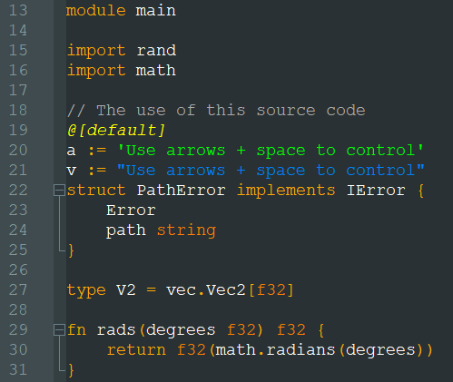
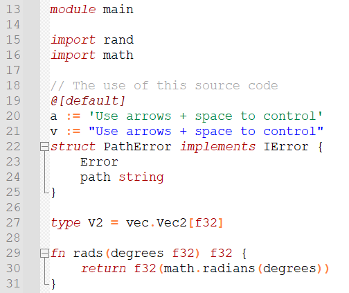

# Vlang syntax file for notepad++

Notepad++ syntax highlighting for Vlang.

Use:

    Download vlang_dark_udl.xml or/and vlang_white_udl.xml
	
    In Notepad++ open Language -> Define your language
	
    Use Import to add Vlang syntax highlighting to files with .v extension and choose the downloaded file.

Dark theme

White theme

